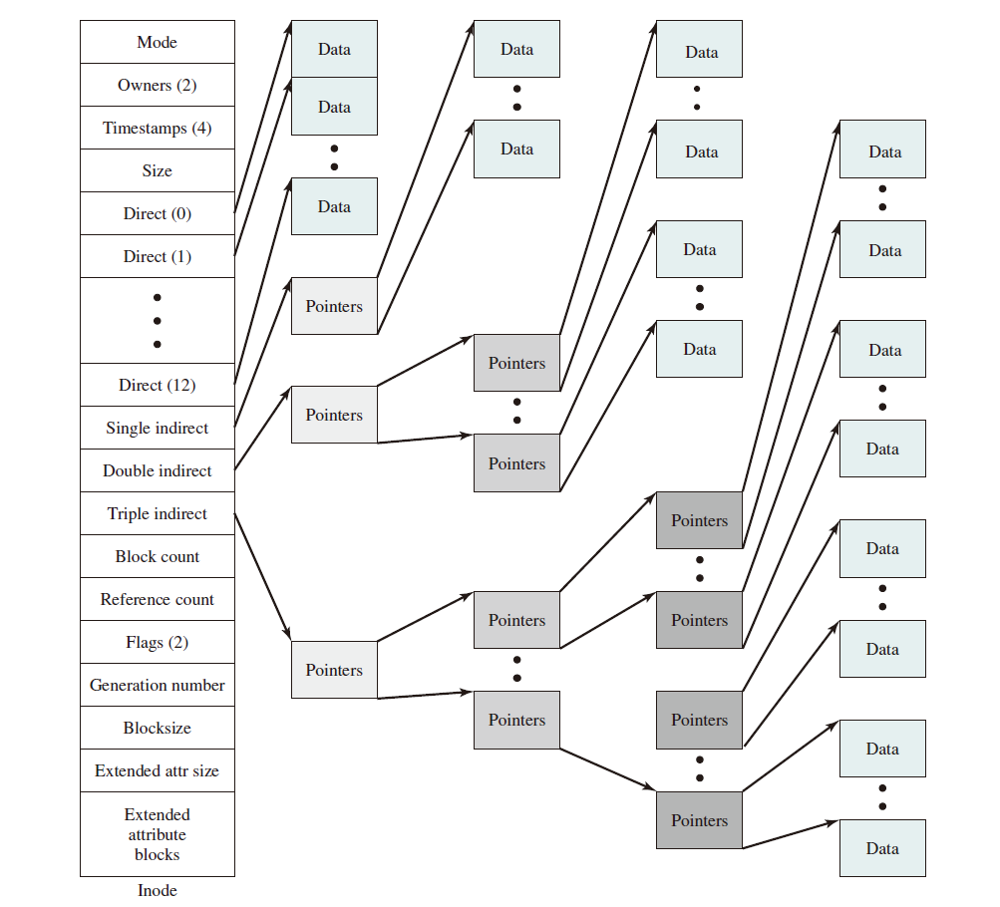
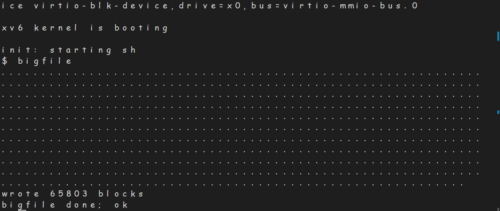
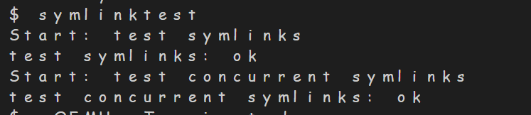
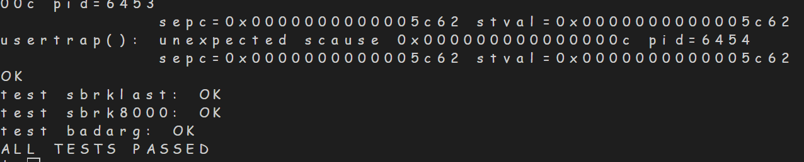

# <center> Lab6 File System
## <center> 邹怡21307130422
---
## 一、Large Files
### 1. 实验原理
原始XV6中的文件块号dinode.addr是使用一个大小为12的直接块表以及一个大小为256的一级块表，即文件最大为12+256块。可以通过将一个直接块表中的项替换为一个二级块表来使系统支持大小为11+256+256*256个块的文件。

根据上图，在原来的xv6系统里，有12个direct pointer和1个single indirect pointer，一共能容纳268个硬盘块，现在要求改成：前11个指针是direct pointer，第12个指针改成single indirect pointer，第13个指针改成double indirect pointer，这样就扩大文件容量到65803块。
### 2. 实验过程以及代码分析
- 修改dinode结构体和inode结构体的相关定义，将其拓展为能容纳direct pointer，single indirect pointer和double indirect pointer的结构。将NDIRECT改为11，增加S_NINDIRECT表示single indirect pointer的容量，D_NINDIRECT表示double indirect pointer的容量，更改addrs数组保证大小不变(注意还要修改file.h中的定义，不然后续会报错).并且修改MAXFILE，确保分配的硬盘块数不会过多。
```
//kernel/fs.h

#define NDIRECT 11
#define S_NINDIRECT (BSIZE / sizeof(uint))
#define D_NINDIRECT (S_NINDIRECT*S_NINDIRECT)
#define MAXFILE (NDIRECT + S_NINDIRECT + D_NINDIRECT)

// On-disk inode structure
struct dinode {
  short type;           // File type
  short major;          // Major device number (T_DEVICE only)
  short minor;          // Minor device number (T_DEVICE only)
  short nlink;          // Number of links to inode in file system
  uint size;            // Size of file (bytes)
  uint addrs[NDIRECT+2];   // Data block addresses
};
```
```
//kernel/file.h

// in-memory copy of an inode
struct inode {
  uint dev;           // Device number
  uint inum;          // Inode number
  int ref;            // Reference count
  struct sleeplock lock; // protects everything below here
  int valid;          // inode has been read from disk?

  short type;         // copy of disk inode
  short major;
  short minor;
  short nlink;
  uint size;
  uint addrs[NDIRECT+2];
};
```
- 修改kernel/fs.c中的bmap()函数，增加二级映射，阅读源码可知，当bn在NDIRECT范围内直接映射，并修正bn，修正后的bn在一级间接映射范围内，则进行一级间接访问，先访问addrs[11]指向的一级指针块，如果没有对应数据块就是用balloc()分配一个新的硬盘块，再是用一级指针块中的指针访问数据块。同理，二级间接映射则在一级间接映射的基础上再加一级指针的操作。计算出索引块和块偏移，进行访问，若没有分配空间就先分配硬盘块再进行访问。
```
static uint
bmap(struct inode *ip, uint bn)
{
  ...

  bn-=S_NINDIRECT;
  if(bn<D_NINDIRECT)
  {
    int index=bn/S_NINDIRECT;
    int offset=bn%S_NINDIRECT;
    if((addr = ip->addrs[NDIRECT+1])==0) //先分配二阶指针的一级pointer
    {
      addr = balloc(ip->dev);
      if(addr == 0)
        return 0;
      ip->addrs[NDIRECT+1] = addr;
    }
    bp=bread(ip->dev, addr); //读取一级间接块内容
    a = (uint*)bp->data;
    if((addr=a[index])==0)
    {
      addr=balloc(ip->dev);
      if(addr)
      {
        a[index] = addr;
        log_write(bp);
      }      
    }
    brelse(bp);

    bp=bread(ip->dev, addr);
    a = (uint*)bp->data;
    if((addr=a[offset])==0)
    {
      addr=balloc(ip->dev);
      if(addr)
      {
        a[offset] = addr;
        log_write(bp);
      }      
    }
    brelse(bp);
    return addr;
  }
  panic("bmap: out of range");
}

```
- 修改kernel/fs.c中的itrunc()，将文件的数据块释放，并将文件大小设置为0.根据已有代码，编写清空二级间接块的代码部分,遍历每一个指向的一级指针，并遍历下一级每个指针，释放二级指针分配的硬盘块，循环结束释放一级指针和根的分配的空间，并重置文件大小，更新inode信息
```
void
itrunc(struct inode *ip)
{
  ...
  // 清空二级间接块
  if(ip->addrs[NDIRECT+1]){
    bp = bread(ip->dev, ip->addrs[NDIRECT+1]);
    a = (uint*)bp->data;
    struct buf *bpd;
    uint* b;

    for(int j=0; j<S_NINDIRECT; j++){
      if(a[j]){
        bpd = bread(ip->dev, a[j]);
        b = (uint*)bpd->data;
        for(int k=0; k<S_NINDIRECT; k++){
          if(b[k])
            bfree(ip->dev, b[k]);
        }
        brelse(bpd);
      }
    }

    brelse(bp);
    bfree(ip->dev, ip->addrs[NDIRECT+1]);
    ip->addrs[NDIRECT+1] = 0;
  }

  // 重置文件大小为0
  ip->size = 0;
  
  // 更新inode信息
  iupdate(ip);
}

```
### 3. 实验结果



## 二、Symbolic links
实现符号链接，符号链接就是在文件中保存指向文件的路径名，在打开文件的时候根据保存的路径名再去查找实际文件。
### 1. 实验过程

- 修改 user/usys.pl、user/user.h、kernel/syscal.h、kernel/syscal.c 以添加一个 system call
```
<!-- user/usys.pl -->
entry("symlink");

<!-- user/user.h -->
int symlink(char*,char*);

<!-- kernel/syscal.h -->
#define SYS_symlink 22

<!-- kernel/syscal.c -->
extern uint64 sys_symlink(void);

static uint64 (*syscalls[])(void) = {
...
[SYS_symlink] sys_symlink,
};

```
- 向 kernel/stat.h 中添加新的文件类型 T_SYMLINK
```

#define T_SYMLINK 4 //Symbolic Link
```
- 向 kernel/fcntl.h 中添加新标志 O_NOFOLLOW
```

#define O_NOFOLLOW  0x800
```
- 在kernel/sysfile.c中编写sys_symlink()函数。从用户空间获取目标路径和链接路径的字符串，如果失败则返回 -1。`begin_op();`开始文件系统操作，获得文件系统的锁。检查目标路径是否存在，如果存在则检查它是否是目录，如果是目录则返回错误。创建一个类型为 T_SYMLINK 的inode，即软链接inode。将目标路径写入软链接的数据块。如果写入失败，则触发 panic。解锁inode并将其放入inode表。结束文件系统操作，释放文件系统的锁。
```
uint64
sys_symlink(void)
{
  char target[MAXPATH], path[MAXPATH];  
  struct inode *ip,*dp;

  if(argstr(0, target, MAXPATH) < 0 || argstr(1, path, MAXPATH) < 0)
    return -1;

  begin_op();
  if((ip=namei(target))!=0)
  {
    if(ip->type==T_DIR)
    {
      end_op();
      return -1;
    }
  }
  if((dp = create(path, T_SYMLINK, 0, 0)) == 0){
    end_op();
    return -1;
  }

  if(writei(dp, 0, (uint64)target, 0, MAXPATH)!=MAXPATH){
    panic("writei error!");
    return -1;
  }

  iunlockput(dp);
  end_op();
  return 0;

}
```
- 修改sys_open()函数,当模式不为`O_NOFOLLOW`时，递归进行符号链接处理，并设定深度为10，超过10次说明可能发生循环链接，返回-1，否则读取软链接的内容，并将链接地址写入path，查找软链接指向的目标inode，赋给dp，并解锁当前的inode，锁定目标inode，更新ip
```
uint64
sys_open(void)
{
  char path[MAXPATH];
  int fd, omode;
  struct file *f;
  struct inode *ip,*dp;
  int n;
...

  //symlink
  if(ip->type == T_SYMLINK&&!(omode & O_NOFOLLOW)){
    int i = 0;
    while(ip->type == T_SYMLINK){
      if(i == 10){
        iunlockput(ip);
        end_op();
        return -1; // max cycle
      }
      if(readi(ip,0,(uint64)path,0,MAXPATH)==0)
      {
        iunlockput(ip);
        end_op();
        return -1;
      }
      if((dp=namei(path))==0)
      {
        iunlockput(ip);
        end_op();
        return -1;
      }
      iunlockput(ip);
      ip=dp;
      ilock(ip);
      i++;
    }
  }

 ...
}
```
- 在makefile中加入symlinktest路径
```
UPROGS=\
	...
	$U/_symlinktest\
```
### 2. 实验结果
symlinktest和usetests均通过

