# <center> Lab3 Page Table
## <center> 邹怡21307130422
---
## part1 加速系统调用速度

<p>     这个实验的原理就是，将一些数据存放到一个只读的共享空间中，这个空间位于内核和用户之间。这样用户程序就不用陷入内核中，而是直接从这个只读的空间中获取数据，省去了一些系统开销，加速了一些系统调用。这次的任务是改进  getpid()  。</p>

- 在 kernel/proc.h proc 结构体中添加一项指针来保存页表地址
- 在 kernel/proc.c 的 allocproc() 中为其分配空间(kalloc)。并初始化其保存当前进程的pid
- 在 kernel/proc.c 的 proc_pagetable() 中将这个映射（PTE）写入 pagetable 中，权限是用户态可读
- 在 kernel/proc.c 的 freeproc() 中确保释放进程的时候，能够释放该共享页，将页表插入空闲页链表中
- 在 kernel/proc.c 的 proc_freepagetable() 中解除映射关系
1.先根据pgtbltest.c中的函数调用

    

再找到ugetpid()函数的调用：

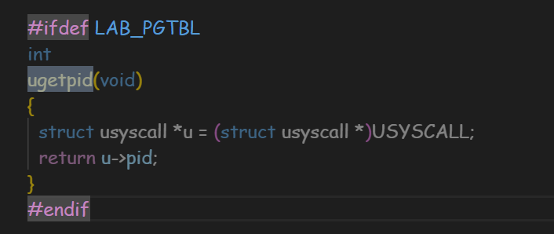

并查看usyscall结构体组成，发现保存了pid

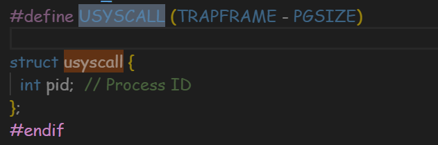

当每一个进程被创建，映射一个只读的页在 `USYSCALL` （在`memlayout.h`定义的一个虚拟地址）处。存储一个 `struct usyscall` （定义在 `memlayout.h`）结构体在该页的开始处，并且初始化这个结构体来保存当前进程的 `PID`。这个 lab 中，`ugetpid() `已经在用户空间给出，它将会使用` USYSCALL `这个映射。
2.故先在`kernel/proc.h`中的proc结构体中增加一个指针保存用户系统调用共享页面的地址：
```  struct usyscall *usyscallpage; ```
3.接着在 `kernel/proc.c `的 `allocproc()` 中为其分配空间。并初始化其保存当前进程的PID。

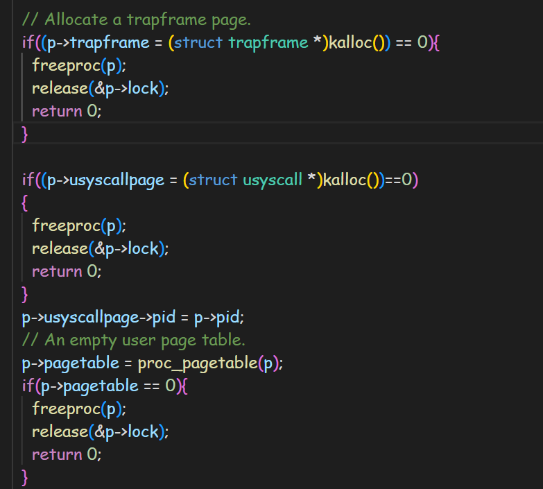

4.在`kernel/proc.c `的`proc_pagetable()`中将映射写入pagetable，这部分代码参考trapframe写入的部分，并且将其设置为用户可读
参考代码：

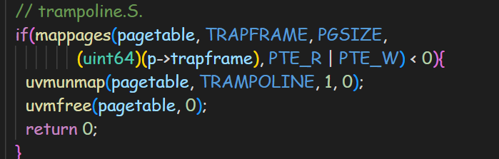

依据上面代码分析mappages()函数的参数分别代表：
- pgdir：这是一个指向页目录的指针，它指向要执行映射操作的页目录。
- va：虚拟地址（Virtual Address），是要映射的虚拟地址。
- sz：映射的大小，通常以页（Page）为单位，通常是 PGSIZE，即页面的大小。
- pa：物理地址（Physical Address），是要映射到的物理地址。
- perm：权限标志（Permission Flags），这是一个包含 PTE 标志的变量，它定义了映射的权限，例如读取、写入、用户态权限等。
<br>故仿写上面参考代码，同时要注意将上面映射好的都释放掉：

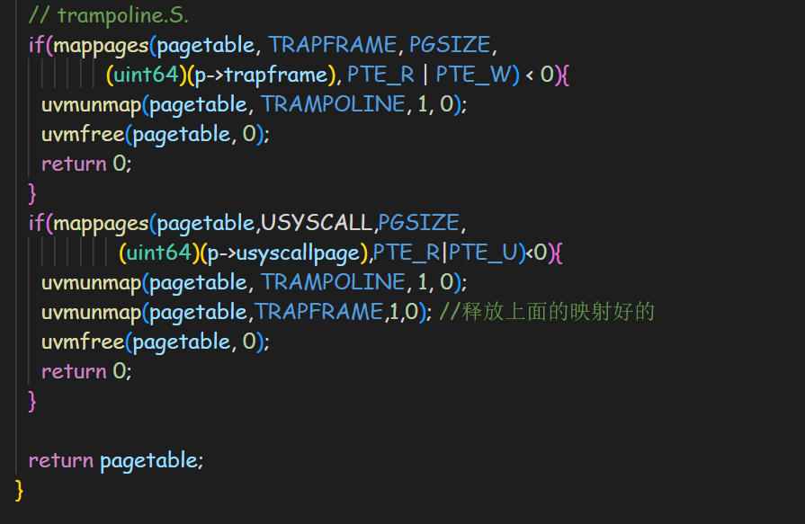

5.在`kernel/proc.c`中的freeproc()进行释放
参考代码：

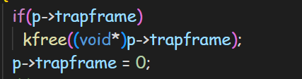

实现：


6.在proc_freepagetable()中增加语句解除映射关系

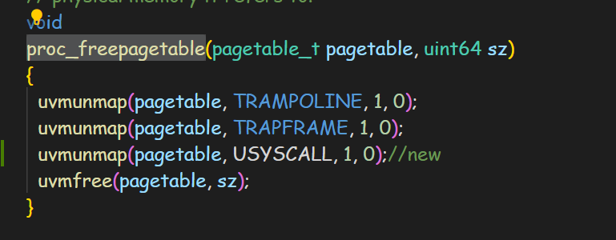

#### 实验结果

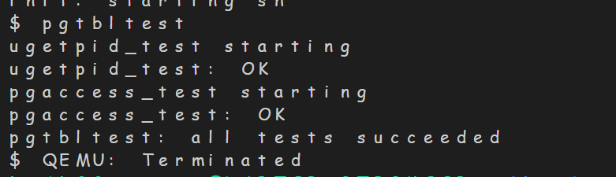

---

## part2 打印页表
写一个函数来打印页表的内容。这个函数定义为 `vmprint() `。它应该接收一个` pagetable_t `类型的参数，并且按照下面的格式打印。在 `exec.c` 中的 `return argc` 之前插入` if(p->pid==1) vmprint(p->pagetable)` ，用来打印第一个进程的页表。

    可以将 vmprint() 实现到 kernel/vm.c 中。
    使用在 kernel/riscv.h 文件末尾的宏定义。
    函数 freewalk 的实现方法对本实验很有帮助。
    将函数 vmprint 的声明放到 kernel/defs.h 中，以便可以在 exec.c 中调用它。
    使用 %p 格式化打印64位十六进制的 PTEs 和 地址。

1.先查看`freewalk`函数的具体实现，该函数释放所有页表，是通过递归进行释放，其中`pte_t`是页表项数据类型，储存了页表的相关信息，子页表的信息可以通过PTE2PA函数进行获取

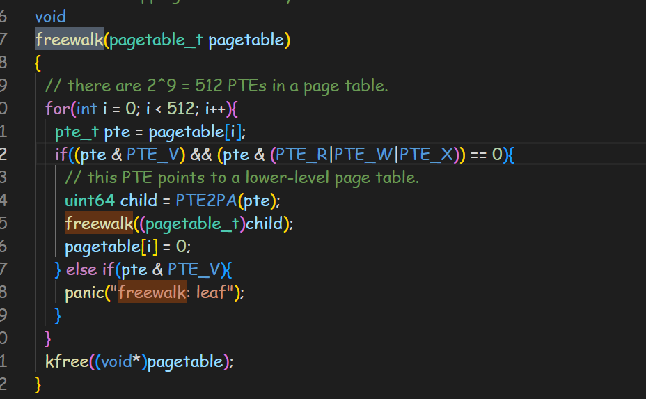

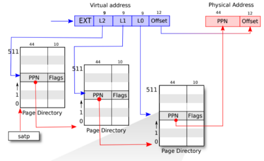

2.由于页表只有三级，故可以使用迭代法三层循环进行打印,在第一层循环中获取页表，并进行判断，获取下一级页表以后进行打印并进入下一层迭代，如此进行3次
```
//new vmprint
void
vmprint(pagetable_t pagetable){
  printf("page table %p\n",pagetable);
  for(int i=0;i<512;i++)
  {
    pte_t pte = pagetable[i];
    if(pte&PTE_V)
    {
      uint64 pa2 = PTE2PA(pte);//pa2存储下一级页表
      printf("..%d: pte %p pa %p\n",i,pte,pa2);
      for(int j=0;j<512;j++)
      {
        pagetable_t pagetable1 = (pagetable_t)pa2; //重新转化成页表数据类型
        pte_t pte=pagetable1[j];
        if(pte&PTE_V)
        {
          uint64 pa1=PTE2PA(pte);
          printf(".. ..%d: pte %p pa %p\n",j,pte,pa1);

          for(int k=0;k<512;k++)
          {
            pagetable_t pagetable0=(pagetable_t) pa1;
            pte_t pte=pagetable0[k];
            if(pte&PTE_V)
            {
              uint64 pa0=PTE2PA(pte);
              printf(".. .. ..%d: pte %p pa %p\n",k,pte,pa0);
            }
          }
        }
      }
    }
  }
}

```
3.在exec.c中调用函数

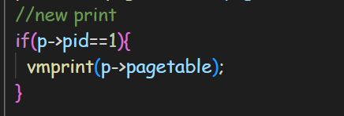

4.在`defs.h`中进行声明

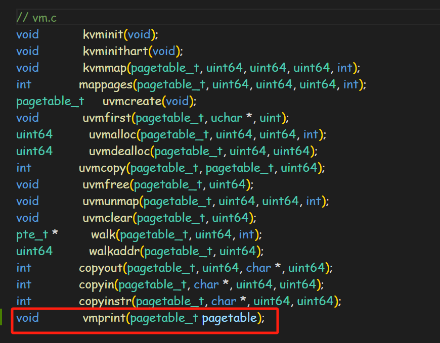

#### 实验结果

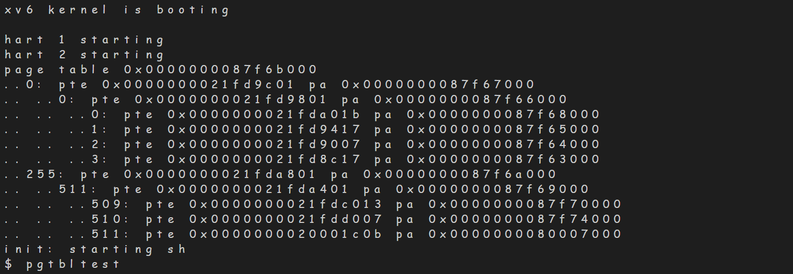
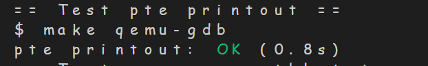

---
## part3 检测哪些页被访问
实现 pgaccess(), 作用是报告哪些页被访问过。此系统调用接受三个参数，第一：被检查的第一个用户页的起始虚拟地址；第二：被检查页面的数量；第三：接收来自用户地址空间的一个 buffer 地址，将结果以掩码（bitmask）的形式写入
1.先分析`pgaccess_test`，创建了一个buf，给他分配了32页，然后修改其中三页，看是否能返回正确的内容。

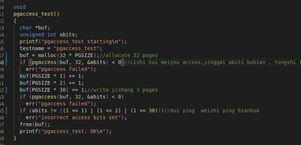

2.在`kernel/riscv.h`中增加PTE_A，并查阅资料发现他在页表信息的第六位

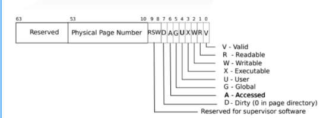
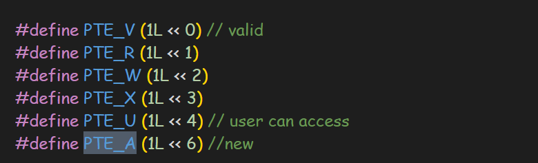

3.补全`sysproc.c`中的`sys_pgaccess()`,先考虑参数传递，由于pgaccess()传递了三个参数，第一个和第三个是地址，第二个是int，故分别用`argaddr(),argint(),argaddr()`,随后设置64位掩码用来存储记录哪一个页表被访问过了，并通过`myproc()`获取当前进程。遍历每个页表，通过walk()函数获取当前页表的信息，如果被访问过，就将掩码对应位数置1，并清除PTE_A,将页表的地址指向下一个虚拟页的起始地址。最后通过copyout将maskbits穿回用户空间
```
int
sys_pgaccess(void)
{
  // lab pgtbl: your code here.
  uint64 addr;
  int num;
  uint64 abits;
  argaddr(0,&addr);
  argint(1,&num);
  argaddr(2,&abits);

  uint64 maskbits = 0;
  struct proc *p = myproc();
  pte_t *pte;
  for(int i=0;i<num;i++)
  {
    pte = walk(p->pagetable,addr,0);
    if(pte==0)
    {
      panic("page not exits.");
      return -1;
    }
    if(PTE_FLAGS(*pte)&PTE_A)
    {
      maskbits = maskbits|(1L<<i);
      *pte &=(~PTE_A);
    }
    addr +=PGSIZE;
  }
  if(copyout(p->pagetable,abits,(char*)&maskbits,sizeof(maskbits))<0)
  {
    return -1;
  }
  return 0;
}
```
#### 运行结果


## 实验中的问题与解决
在进行实验一时，一直出现usertrap()报错，经过gdb调试，发现当创建子进程后`wait(&ret)`会导致内陷,推测是初始化时出现问题
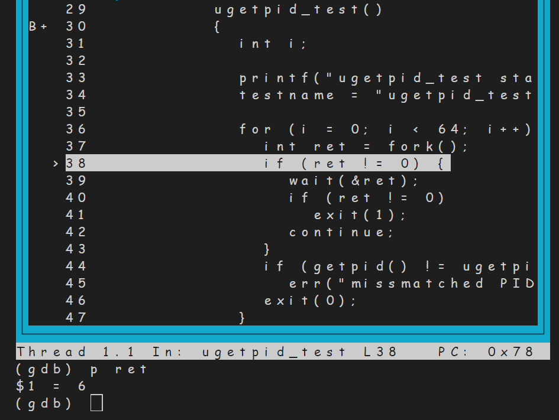
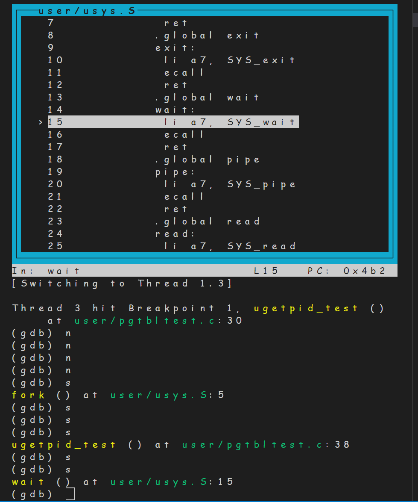
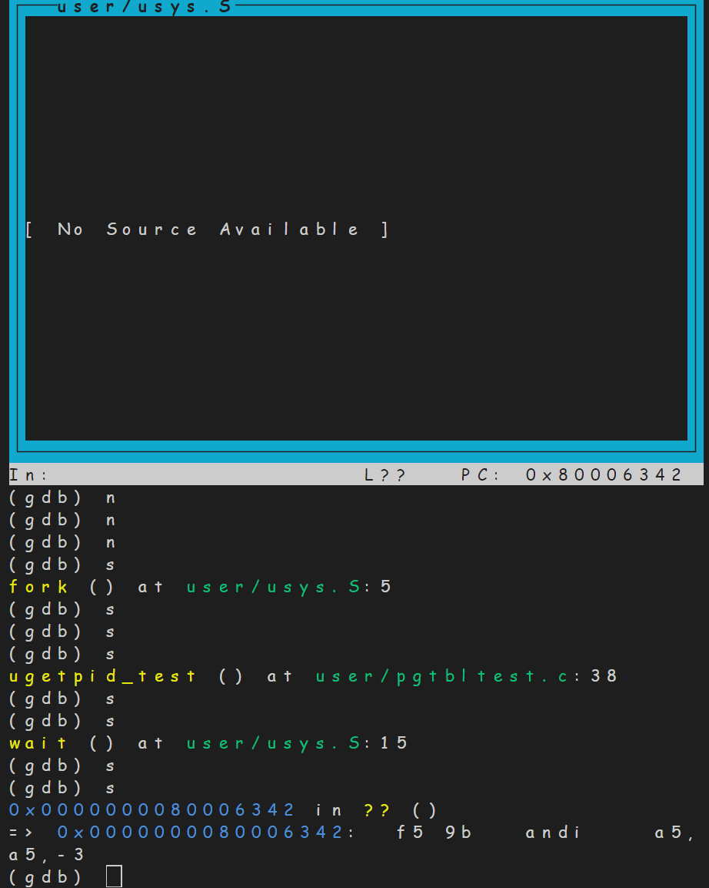

观察初始化分配页表的代码，发现在p->usyscallpage被分配空间之前，要先让p->pagetable获取页表，如果页表分配失败，即内存不足或其他的错误，就会直接返回并且释放空间，这会导致p->usyscallpage没有被分配空间，可能会导致后续访问缺页，从而导致trap
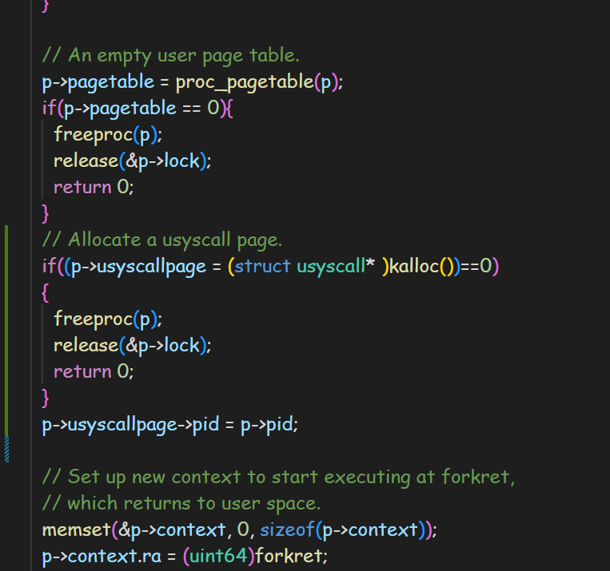