# <center> OSLab4 Traps
## <center> 邹怡21307130422
---
## RISC-V
1. Which registers contain arguments to functions? For example, which register holds 13 in main's call to printf?
- a0~a7都可保存函数参数。a2寄存器保存13.

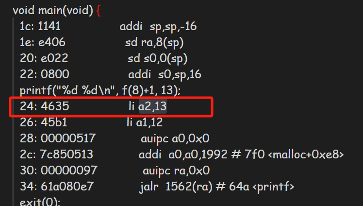

2. Where is the call to function f in the assembly code for main? Where is the call to g? (Hint: the compiler may inline functions.)
- 在main函数中并没有显式调用f，f中也没有显式调用g，编译器使用内联函数，main函数中直接计算出f(8)+1的地址，省略显式调用f和g的过程`  26:	45b1                	li	a1,12`，在f中通过
```  
14:	250d                addiw	a0,a0,3
16:	6422                ld	s0,8(sp)
```
计算g的地址

3. At what address is the function printf located?
- `0x64a` 0x30+0x0+1562(0x61a)

4. What value is in the register ra just after the jalr to printf in main?
- ra的值是0x38，也就是返回地址
5. Run the following code.unsigned 
```
int i = 0x00646c72;
printf("H%x Wo%s", 57616, &i);
```
What is the output? Here's an ASCII table that maps bytes to characters.The output depends on that fact that the RISC-V is little-endian. If the RISC-V were instead big-endian what would you set i to in order to yield the same output? Would you need to change 57616 to a different value?

- 输出为`HE110 World`,如果是大端法要将i设置为`0x726c6400`,不需要改变57616的值，因为E110是57616对应的十六进制数，不会因为大端小端改变
6. In the following code, what is going to be printed after 'y='? (note: the answer is not a specific value.) Why does this happen?`printf("x=%d y=%d", 3);`
- 取决于调用printf之前a2寄存器的值，因为根据之前的汇编代码可以知道printf第二个参数是存储在a2寄存器中的,经过gdb调试本次结果是1

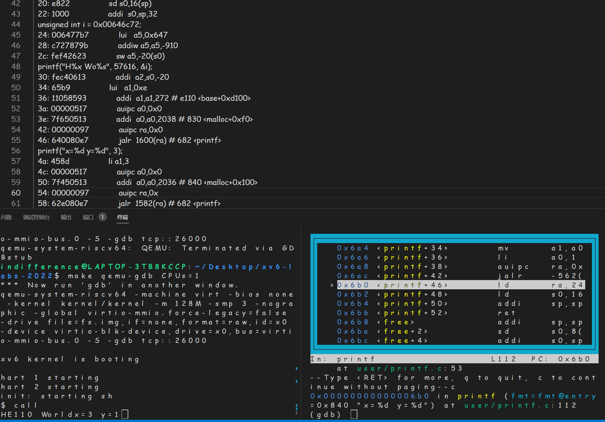

---
## Backtrace
### 实验内容
- 编写函数backtrace()函数，递归读取栈桢，并输出函数返回的地址值
- 参考下面栈桢的结构，发现旧的fp与当前fp相差16，即previous fp=fp-16，返回地址则是当前fp-8，故输出时可以考虑通过迭代，只要fp没有超过当前页，就让其等于previous fp，通过不断迭代回溯函数并打印返回值
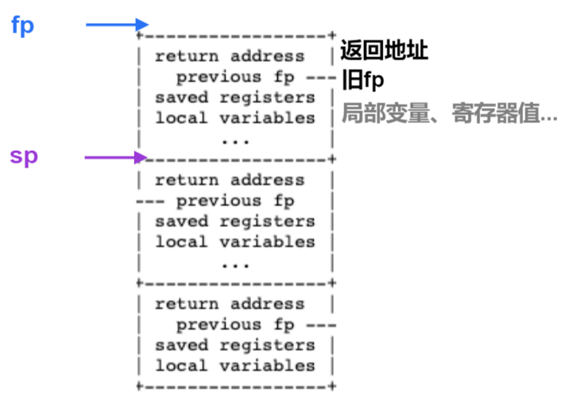

### 步骤
1. kernel/riscv.h ：添加下面函数可获取s0寄存器保存的fp的值

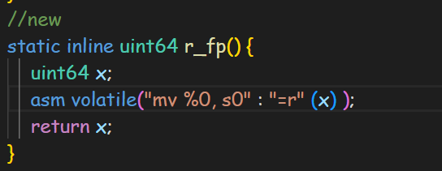

2. kernel/defs.h中添加backtrace()的函数声明

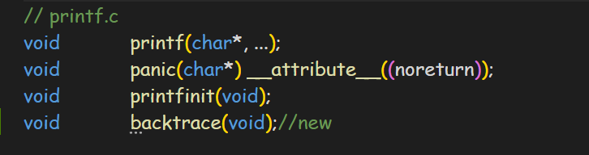

3. kernel/sysproc.c：调用backtrace()函数
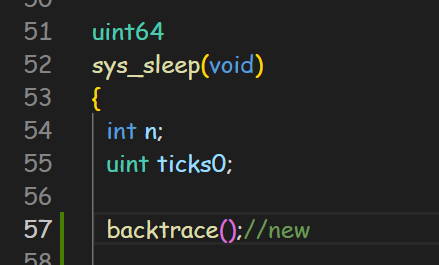
4. kernel/printf.c:
- 先通过r_rp()函数获取当前栈的fp值
- 在fp未到达页面顶之前，根据栈桢结构，打印ra，并将fp回退到上一个fp的地址，并更新pre_fp,其中PGROUNDDOWN(fp)表示当前fp所在页的最低地址，PGROUNDUP(fp)表示当前fp所在页的最高地址，如果fp在这两个地址之间，说明没有越界，故作为循环判断的条件
```
void 
backtrace(void)
{
  printf("backtrace:\n");
  uint64 fp;
  fp=r_fp();
  uint64 pre_fp=*((uint64*)(fp-16));
  uint64 top=PGROUNDUP(fp),bottom=PGROUNDDOWN(fp);
  while(fp>bottom&&fp<top)
  {
    uint64 ra=*((uint64*)(fp-8));
    printf("%p\n",ra);
    fp=pre_fp;
    pre_fp=*((uint64*)(fp-16));
  }
}
```
### 测试结果
运行xv6，调用bttest程序，那么就会打印栈帧中ra的值，这都是一些地址值。
退出qemu，并使用addr2line程序，对地址进行转换就可以获得返回地址对应文件的行
发现是 backtrace() 函数的所有调用栈的返回地址(函数调用完后的下一代码).
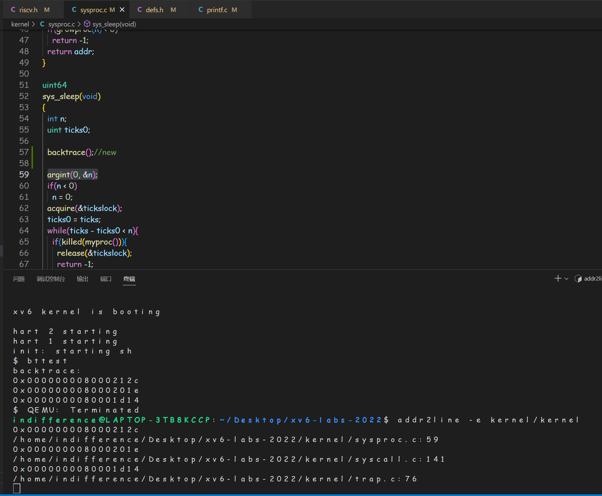
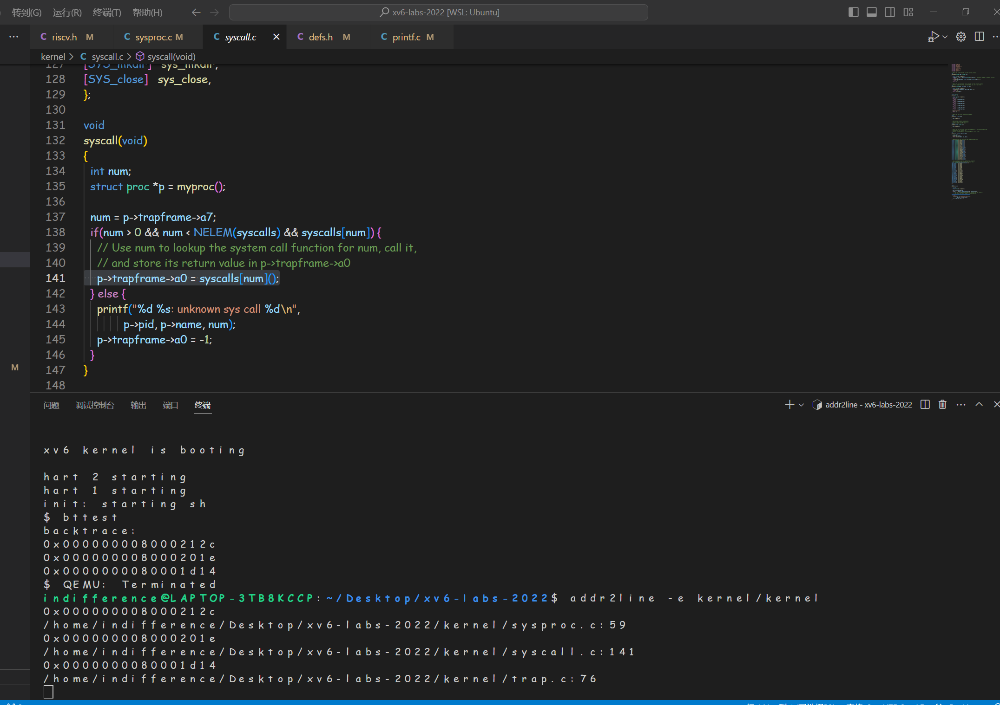
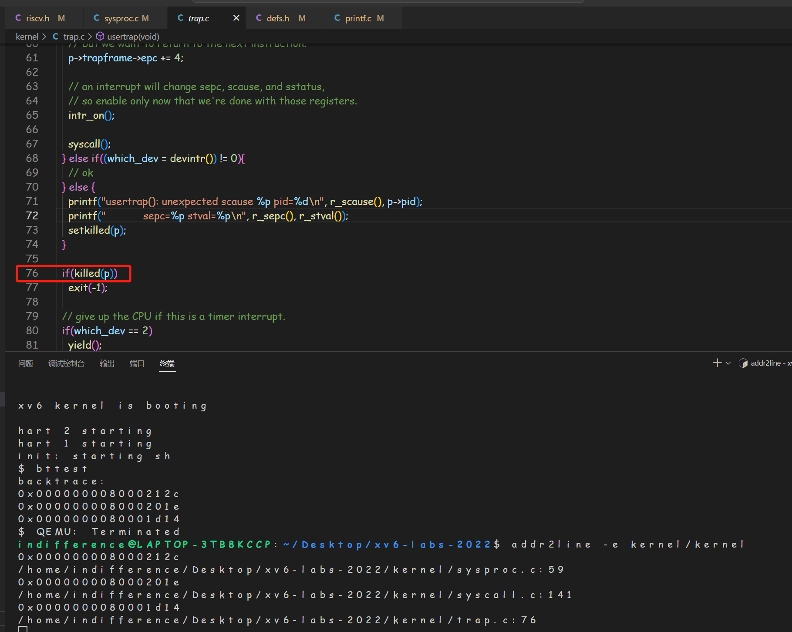

---
## Alarm
本次实验主要是实现两个系统调用sigalram(int,void(*handler)())、sigreturn()。通过这两个系统实现alarm功能，监测用户程序使用CPU的时长，从而对用户程序发出提醒。
- sigalarm：第一个参数是设置时钟中断个数当达到个数时调用指定函数，第二个参数时设置alarm的处理函数。
- sigreturn：在alarm处理函数中执行完所以代码后调用，主要功能是恢复中断前的状态。

监测时间主要是以时钟中断为单位(进程调度的基础)，如果时钟中断为50ms，那么每50ms进行一次中断，那么通过统计用户进程进行了几次中断，就可以获知用户进程到达了警报的CPU使用时长，从而给出提醒。

### 实验准备
1. 在makefile中添加alarmtest用户程序
```
UPROGS=\
...
$U/_alarmtest\
```
2. kernel/syscall.h和kernel/syscall.c中添加函数调用声明：
```
----syscall.h
#define SYS_sigalarm 22
#define SYS_sigreturn 23

----syscall.c
extern uint64 sys_sigalarm(void);
extern uint64 sys_sigreturn(void);

static uint64 (*syscalls[])(void) = {
...
[SYS_sigalarm] sys_sigalarm,
[SYS_sigreturn] sys_sigreturn,
}
```
3. user/user.h中添加系统调用定义，user/usys.pl添加系统调用入口
```
----user.h
int sigalarm(int, void (*)());
int sigreturn(void);
----usys.pl
entry("sigalarm");
entry("sigreturn");
```

## test0
实现sigalarm(n,fn)系统调用此函数会以n个单位时间为间隔，调用fn函数当调用sigalarm(0,0)时，表示停止sigalarm的间隔调用过程,在test0循环中，不断调用write系统调用，内核产生时钟中断，当时钟中断的数量到达触发alarm的数量时，将设置frame中epc寄存器值为处理函数入口地址，(epc储存了发生中断时用户程序的指令地址)
### 实现步骤
1. 在kernel/proc.h中proc结构体添加字段：
- interval：触发alarm所需的时钟中断数量 
- ticks：统计时钟中断的数量
- handler：记录处理alarm的函数的地址
```
struct proc{
  ...
  int interval;
  int ticks;
  uint64 handler;
  ...
}
```
2. 在kernel/sysproc.c中添加sys_sigalarm()和sys_sigreturn()函数(sys_sigreturn()在test0中返回0即可)
- 在sys_sigalarm()中读入传进的参数，根据alarmtest.c中可知第一个参数是触发alarm的时钟中断数量 ，第二个参数是处理alarm的函数的地址。初始化p->interval ,p->handler, p->ticks  
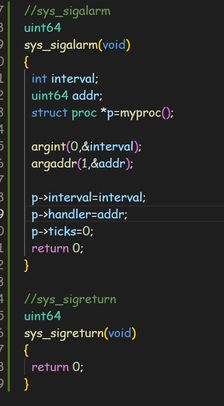
3. 在kernel/trap.c的usertrap函数中统计发生时钟中断次数，并在触发alarm时修改p->trapframe->epc。阅读代码可知which_dev=2时发生时钟中断。
```
void
usertrap(void)
{
 ...
  // give up the CPU if this is a timer interrupt.
  //需要修改，当发生时钟中断时，在进程的警报间隔到期时，用户进程执行handler。
  if(which_dev == 2)
  {
    p->ticks++;
    if(p->interval>0&&p->ticks==p->interval)
    {
      p->trapframe->epc=p->handler;
    }
    else{
      yield();
    }
    
  }
...
}
```
### 实验结果：
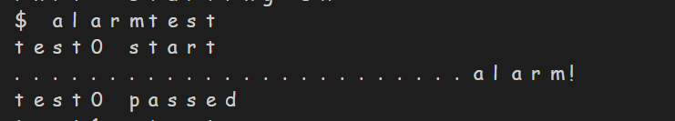

---

### test1,2,3
与test0对比，需要保存中断前的函数调用栈的寄存器,在test0的基础上，通过修改`trapframe->epc`的方式修改时钟中断的处理函数，但是原本的epc被覆盖，并且没有保存寄存器，寄存器中的值也被覆盖。
在系统调用时：
- 调用sys_sigalarm前，寄存器信息保存在trapframe中，执行sys_sigalarm()系统调用函数，为ticks等字段赋值，返回后通过trapframe的寄存器值恢复，不用保存
- 当进行一定次数的时钟中断后，将返回地址更改为了handler函数，此时ret后开始执行handler函数，此时当我们想再回到调用handler前的状态时，会发现trapframe中存放的是sys_sigreturn执行前的trapframe，无法返回到用户态的状态
- 从alarmtest中可以发现，每次执行完handler会调用sigreturn函数，用于恢复之前的状态。这要求在每次执行handler前要保存当时的寄存器信息，保证能恢复用户态的状态。
### 代码实现
1. 在test0基础上在kernel/proc.h中添加新字段存储执行handler前栈的寄存器信息
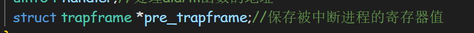
在proc.c中进行初始化和释放空间
allocproc()：


freeproc():

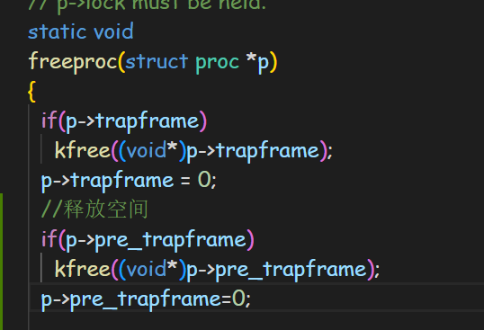

2. 在出发alarm的时钟中断条件时，进入usertrap()函数后用pre_trapframe保存当前进程中trapframe的寄存器值

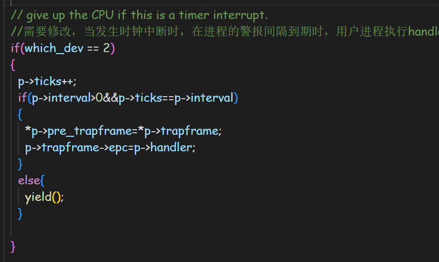

3. 在sys_sigreturn()中将trapframe恢复为执行handler前的栈桢值（即pre_trapframe），由于系统调用会将返回值储存于a0寄存器，故作为返回值

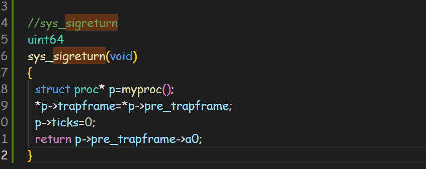

### 实验结果
执行alarmtest通过test1/test2/test3测试
执行usertests -q确保没有破坏其他函数功能
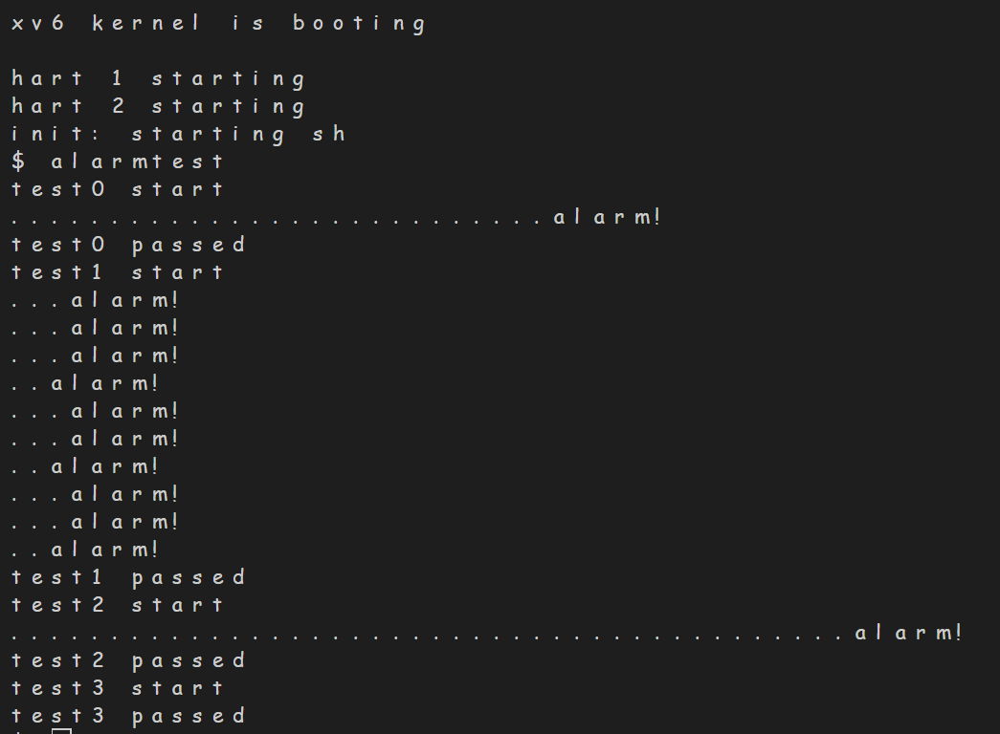
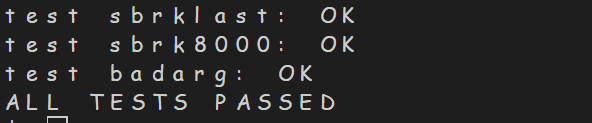