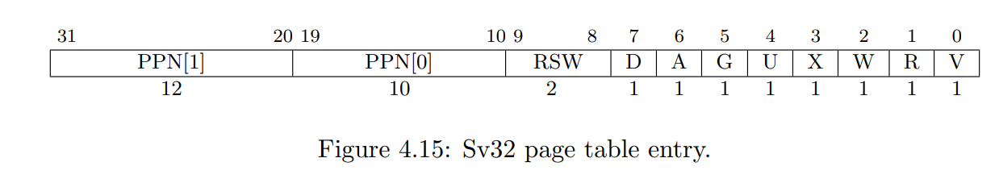
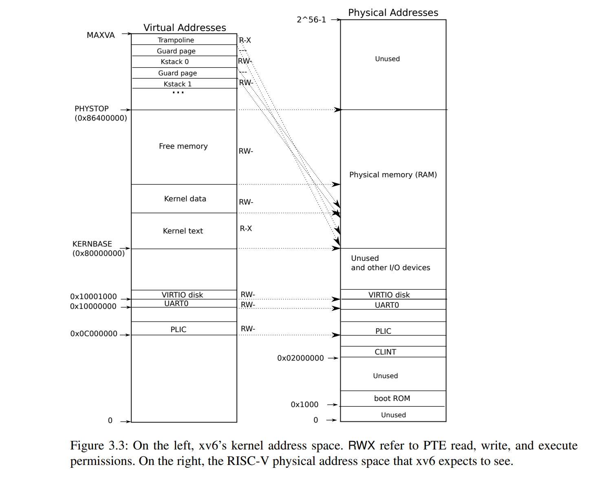
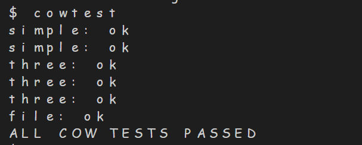
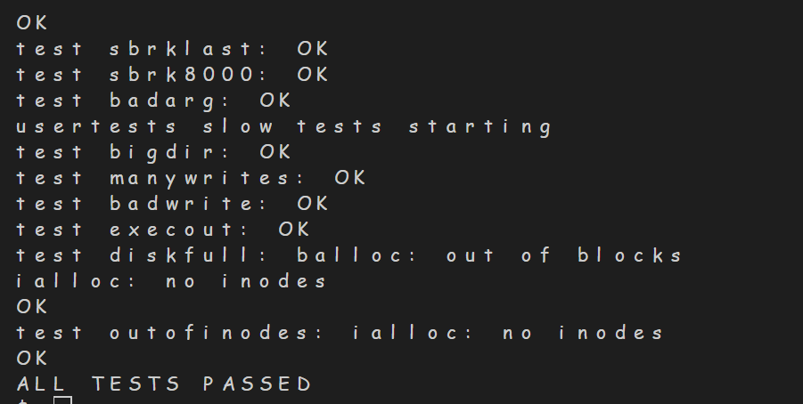

# <center>OSLAB5 COW
## <center> 邹怡21307130422
--- 
## 一、实验内容

实现写时复制(copy on write)，由于在实际应用中，调用fork()后往往会调用exec()使得创建子进程所分配的内存不会被使用到，浪费内存空间。

为了解决上面的问题，在fork()时，并不给子进程分配物理空间，只有当父进程或者子进程要往进程的页帧中写入数据时，才进行复制页帧。

具体的流程如下：
- fork()时，为子进程创建页表，页表PTE条目指向父进程的物理内存页帧，不为子进程分配物理内存帧
- 将父进程和子进程的PTE_W设置为0(即设置为不可写)
- 当父进程或者子进程要往物理页帧写入数据时，会造成缺页中断，进入usertrap()函数
- 此时为进入中断的进程分配物理页帧，将原始的页面复制到新页面中，并修改相应的PTE将其标记为可写
---

## 二、代码实现
### 1. 修改kernel/vm.c中uvmcopy()函数：
- 让父进程与子进程共享物理内存，而不是给子进程单独分配物理空间，将子进程的虚拟地址映射到父进程的物理内存
- 将父进程和子进程的PTE_W清除，设置成不可写，使得要进行写数据时会进入usertrap函数进行COW页的空间分配，将父进程和子进程设置为COW页(即设置PTE_C位)，由于PTE有10个标志位，8个已经被定义，故将8位设置为PTE_C



```
//kernel/riscv.h

#define PTE_C (1L << 8) //标记COW页
```

- 引用计数自增1
```
int
uvmcopy(pagetable_t old, pagetable_t new, uint64 sz)
{
  pte_t *pte;
  uint64 pa, i;
  uint flags;

  for(i = 0; i < sz; i += PGSIZE){
    if((pte = walk(old, i, 0)) == 0)
      panic("uvmcopy: pte should exist");
    if((*pte & PTE_V) == 0)
      panic("uvmcopy: page not present");
    
    pa = PTE2PA(*pte);
    if(*pte&PTE_W)
    {
      *pte&=(~PTE_W);//清除PTE_W
      *pte|=PTE_C;
    }
    
    flags = PTE_FLAGS(*pte);
    // if((mem = kalloc()) == 0)
    //   goto err;
    // memmove(mem, (char*)pa, PGSIZE);
    if(mappages(new, i, PGSIZE, (uint64)pa, flags) != 0){
      printf("uvmcopy error!\n");
      goto err;
    }
    refcnt_increase(pa);
  }
  return 0;

 err:
  uvmunmap(new, 0, i / PGSIZE, 1);
  return -1;
}
```

### 2. 修改usertrap():
- 当要进程往COW页帧写入数据，会发生写入缺页故障，进入usertrap()函数，此时需要先给COW页分配物理空间，并将旧页的数据复制到新页，并修改PTE_C和PTE_W
- 经过查询文档得知当出现写入缺页故障时scause的寄存器为15
```
void
usertrap(void)
{
  ...
  else if((which_dev = devintr()) != 0){
    // ok
  } 
  else if(r_scause()==15 && cow_uncopied(p->pagetable,r_stval()))//发生写入缺页
  {
    if(cow_alloc(p->pagetable,r_stval())<0){
      setkilled(p);
    }
  }
  else {
    printf("usertrap(): unexpected scause %p pid=%d\n", r_scause(), p->pid);
    printf("            sepc=%p stval=%p\n", r_sepc(), r_stval());
    setkilled(p);
  }
    ...
}
```
- 进行分配之前要先判断当前页是否是COW页，在kernel/vm.c中编写cow_uncopied()函数，用于判断是否是未分配的可用的COW页
```
int 
cow_uncopied(pagetable_t pagetable, uint64 va)
{
  pte_t *pte;

  if(va >= MAXVA)
    return 0;

  pte = walk(pagetable, va, 0);
  if(pte == 0)
    return 0;
  if((*pte & PTE_V) == 0)
    return 0;
  if((*pte & PTE_U) == 0)
    return 0;
  
  return ((*pte)&PTE_C);
}
```

- 编写kernel/vm.c中的cow_alloc()函数，为COW页分配物理空间，设置PTE_W和PTE_C，并将父进程的页帧数据复制到新的页，取消赋父进程页帧的映射，并将新页映射到物理内存
```
int 
cow_alloc(pagetable_t pagetable, uint64 va){
  pte_t* pte = walk(pagetable, va, 0);
  uint flag;
  if(pte == 0) return -1;
  uint64 newpage = (uint64)kalloc();     
  if(!newpage){
    return -1;
  }
  va = PGROUNDDOWN(va); // 如果直接使用va取消映射，可能会取消整个区域的映射
  uint64 pa = PTE2PA(*pte); 

  *pte &= (~PTE_C); // 复制之后不是 COW 页
  *pte |= PTE_W;    // 复制之后可写
  flag=PTE_FLAGS(*pte);
  memmove((void*)newpage, (void*)pa, PGSIZE); // 把父进程页帧的数据复制一遍
  uvmunmap(pagetable, va, 1, 1);      // 然后取消对父进程页帧的映射
  
  if(mappages(pagetable, va, PGSIZE, (uint64)newpage, flag) < 0){// 将子进程进行映射
    kfree((void*)newpage);
    return -1;
  }
  return 0;
}
```
### 3. 引用计数
- 由于父进程与子进程指向同一个物理页帧，在上面的代码中取消父进程页帧的映射时，如果有不止一个子进程共享父进程，那么父进程页帧就会被释放，导致其他子进程使用这个页帧出现问题
- 由于物理空间可用于分配空间的地址有范围，具体范围如下图，从KERNBASE~PHYSTOP，故在设置refcnt时分配数组大小为物理页表最大数量`(PHYSTOP-KERNBASE)/PGSIZE`：



- 对于每个物理页帧，引入一个引用计数，表示有多少个COW页正在共享这个页帧，初始为1，每次调用一次uvmcopy()函数时说明增加一个COW页，引用计数递增
```
//kernel/kalloc.c

struct {
  struct spinlock lock;
  struct run *freelist;
  int refcnt[(PHYSTOP-KERNBASE)/PGSIZE];
} kmem;

void
freerange(void *pa_start, void *pa_end)
{
  char *p;
  p = (char*)PGROUNDUP((uint64)pa_start);
  for(; p + PGSIZE <= (char*)pa_end; p += PGSIZE)
  {
    kmem.refcnt[((uint64)p-KERNBASE)/PGSIZE]=1;//modified
    kfree(p);
  }
}
```
- 添加函数进行引用计数自增
```
//new
void 
refcnt_increase(uint64 pa)
{
  acquire(&kmem.lock);
  kmem.refcnt[(pa-KERNBASE)/PGSIZE]++;
  release(&kmem.lock);
}
```
- 修改kalloc(),增加引用计数初始化，在分配页表空间时，将对应物理页帧的引用计数初始值设置为1
```
void *
kalloc(void)
{
  struct run *r;

  acquire(&kmem.lock);
  r = kmem.freelist;
  if(r)
  {
    kmem.freelist = r->next;
    kmem.refcnt[((uint64)r-KERNBASE)/PGSIZE]=1;//new
  }
    
  release(&kmem.lock);

  if(r)
    memset((char*)r, 5, PGSIZE); // fill with junk
  return (void*)r;
}
```
- 修改kfree(),每次释放页表空间，要将引用计数自减，减少一个COW页，在COW页数量大于0时并不会真正释放物理空间,只有在没有COW页共享这个页表之后，调用kfree()才会释放物理空间,考虑多进程会导致对引用计数refcnt的同时减少造成错误判断
```
void
kfree(void *pa)
{
  struct run *r;

  if(((uint64)pa % PGSIZE) != 0 || (char*)pa < end || (uint64)pa >= PHYSTOP)
    panic("kfree");

  // Fill with junk to catch dangling refs.
  
  acquire(&kmem.lock);
  r = (struct run*)pa;
  kmem.refcnt[((uint64)pa-KERNBASE)/PGSIZE]--;
  if(kmem.refcnt[((uint64)pa-KERNBASE)/PGSIZE]<=0)
  {
    memset(pa, 1, PGSIZE);
    r->next = kmem.freelist;
    kmem.freelist = r;
  }
 
  release(&kmem.lock);
}
```
### 4. copyout()
当在系统调用函数中调用copyout将数据写入页表时，如果页表是COW页，PTE_W没有设置是不可写的，此时会发生缺页，因为在trap.c中如果异常是从系统调用中发生的，会直接panic，会导致copyout工作异常。所以在copyout()函数中，要判断当前页面是否是COW页，若是要先分配空间在进行数据写入
```
int
copyout(pagetable_t pagetable, uint64 dstva, char *src, uint64 len)
{
  uint64 n, va0, pa0;

  while(len > 0){
    va0 = PGROUNDDOWN(dstva);
    if(cow_uncopied(pagetable,va0))//new
      if(cow_alloc(pagetable,va0))
        return -1;
    pa0 = walkaddr(pagetable, va0);
    if(pa0 == 0)
      return -1;
    n = PGSIZE - (dstva - va0);
    if(n > len)
      n = len;
    memmove((void *)(pa0 + (dstva - va0)), src, n);

    len -= n;
    src += n;
    dstva = va0 + PGSIZE;
  }
  return 0;
}
```
### 5. 在kernel/defs.h中添加增加的函数
```
int           cow_uncopied(pagetable_t, uint64);//new
int          cow_alloc(pagetable_t , uint64);//new
void           refcnt_increase(uint64);//new

```
---
## 三、实验结果
cowtest和usertests均通过:





---

## 四、实验总结
- 在实验过程中由于对于cow_uncopied()函数返回值没有理解正确，导致在usertrap()中的判断条件出错，导致无法通过，后来经过gdb调试，发现并没有进入应该进入的if语句中，而是直接打印错误信息，故发现改正。
- 在usertests过程中，出现copyout失败，发现是更改copyout函数时，没有正确处理cow_alloc的条件，需要保证是可用未分配空间的COW页，通过cow_uncopied()函数作为判断条件
- 出现`test textwrite: FAILED`，检查发现在uvmcopy中没有判断本页表项是否本就不可写，如果原本就不可写，就算是COW页也不能更改PTE_W属性，在uvmcopy()中加上判断条件就通过了：
```
    if(*pte&PTE_W)
    {
      *pte&=(~PTE_W);//清除PTE_W
      *pte|=PTE_C;
    }
```